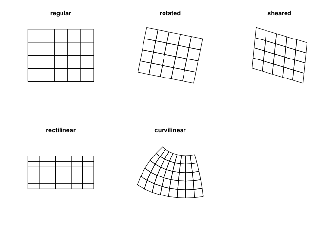

```{r lit, cache=FALSE, include=FALSE}

# create bib-file for citation of R-packages
knitr::write_bib(c("raster", "terra", "stars"),
  file = "refs.bib",
  prefix = "R-"
)

```

<!-- TODO Rmd presentation: -->


<!-- Inhaltsverzeichnis -->
<!-- Fußzeile -->
<!-- Theme -->
<!-- Fondsize -->

```{r setup, include=FALSE}
knitr::opts_chunk$set(echo = FALSE)

library(raster)
library(stars)
library(terra)

library(tidyverse)
library(rasterVis)
library(RColorBrewer)
```

## `Raster` 

- rspatial community <https://www.rspatial.org/>
- creator: Robert J. Hijmans [@R-raster]
- maintainer, authors: ~


### Basics
Rasters are spatial data on a regular grid with elements called "pixels". Contrast to vector data, representing points, lines & polygons (see `sp`, `sf`)

___

### Benefits: 

<br>

- not loading into local memory 
- only stores metainformation (layer number, spatial extent, pixel size) in Raster* objects. 
- Raster*-functions break down tasks to lightweight chunks to be processed sequentially. 

<br> 

-> large scale data will not overload memory


___

```{r 1-raster-import, echo=TRUE}
ras = raster("data/2015-08-23_NDVI.tif")
```
Let's plot a max. pixel number
```{r 1-ndvi-plot, echo=TRUE}

pal = brewer.pal(6, "RdYlGn")

plot(ras, col = pal,
     maxpixels = 10000)

```
___

##

Let's plot only a defined extent:

```{r 1-ndvi-plot2, echo=TRUE}
plot(ras, col = pal,
     ext = c(630000, 660000, 5690000, 5710000))
```

___


### High-level methods

- functions normally implemented in GIS or remote sensing software
- 1st argument: Raster* object (mostly)

crop (subsetting with `sp` object)
trim (removes NA from cropped rasters)
predict (apply a trained model in raster data)

## Terra 

replaces the `raster` package (in the future)

- rspatial community <https://www.rspatial.org/>
- creator: Robert J. Hijmans [@R-terra]
- released July 2019 
- C++ handling of raster data -> much faster than raster
- required `Rtools` for windows build 
- clone development stage from github (not yet on CRAN)

```{r install_terra, echo=TRUE, include=FALSE}
devtools::install_github("rspatial/terra")
```

___

- implements new classes for spatial data (SpatRaster-class)
- out-of-memory raster operations as `stars_proxy`-objects
- rectangular grid (pixels of equal size)

### Functions
- vectors to raster conversions
- local, zonal, global raster operations
- integration with spatial modeling methods

## Stars

- r-spatial community <https://www.r-spatial.org/>
- Edzer Pebesma [@R-stars]
- released ~

##

Handles spatio-temporal data as

- raster cubes (3 dimension)
- raster hypercubes (4 & more dimension)
- vector hypercubes


```{r 3-cube, echo = FALSE, cache = TRUE, px = 200, fig.cap="Multi-dimensional raster cubes [@R-stars]", fig.show = "hold", out.width = "50%"}
knitr::include_graphics("img/cube1.png")
knitr::include_graphics("img/cube2.png")
```

##

   ... also with non-regular grids:

```{r 3-grids, echo = FALSE, cache = TRUE, px = 300, fig.cap="Grid formats allowed as `stars`-object [@R-stars]", fig.show = "hold", out.width = "50%", fig.align='center'}

```


##

Here we can see the similarity with `sf`-verbs and methods:

```{r 3-methods, echo=TRUE}
methods(class = "stars")
```


##
### Architecture
- uses GDAL, netCDF, geos and proj backend
- stars_proxy are .vrt like objects
  * not loaded into memory
  * on-the-fly functions
  * only uses metainformation of the dataset and points to file directory
  * **can handle very large datasets**

##
### `stars_proxy`

```{r 3-proxy, echo=TRUE}
methods(class = "stars_proxy")
```

##
###


### Functions


## References