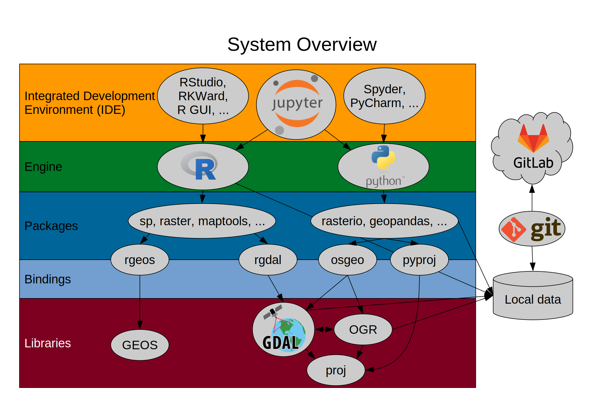

```{r lit, cache=FALSE, include=FALSE}

# create bib-file for citation of R-packages
knitr::write_bib(c("raster", "terra", "stars", "sp", "xts", "spacetime",
                   "abind", "tidyverse", "sf", "rgdal", "parallel"),
  file = "refs.bib",
  prefix = "R-"
)

```

## Table of contents {.larger}

### 1. Raster
### 2. Terra
### 3. Stars

```{r setup, include=FALSE}
knitr::opts_chunk$set(echo = FALSE)

library(raster)
library(stars)
library(terra)

library(tidyverse)
library(RColorBrewer)

pal = brewer.pal(8, "RdYlGn")
```

##

```{r 1-overview, echo = FALSE, cache = TRUE, px = 500, fig.show = "hold", out.width = "80%", fig.align='center', fig.cap="figure from https://geoscripting-wur.github.io/IntroToRaster/ [accessed 27-01-2020]"}

```

# 1. Raster

## Raster

- rspatial community <https://www.rspatial.org/>
- creator: Robert J. Hijmans [@R-raster]
- First CRAN release: 2010-03-20
- revolution of raster processing in R

### Basics

Rasters are spatial data on a regular grid with elements called "pixels". Contrast to vector data, representing points, lines & polygons (see `sp`, `sf`)

- read and write raster data in common formats
- perform common raster operations such as
  - cropping
  - reprojection
  - resampling etc.
- fast operations due to C code backended
- visualise data

##

### Benefits

- not loading into local memory 
- only stores metainformation (layer number, spatial extent, pixel size) in Raster* objects. 
- Raster*-functions break down tasks to lightweight chunks to be processed sequentially.
- can iterate functions over large files on disc
- takes care of the caching via `rgdal` [@R-rgdal] or `ncdf4`
- feases most raster operations possible in desktop GIS systems (and more...)
- capacity to run in parallel with `parallel` [@R-parallel]


##

### Methods (overview)

* raster algebra: `+`, `-`, `*`, `/`, `>`, `abs`, `sum` (built-in functions)
* `raster()`: Read a single-layer raster object
* `stack()`: Assemble RasterLayers in a multilayer object. (Can handle different file inputs)
* `brick()`: Read a multi-layer raster object written on disk.
* `writeRaster()`: Write a RasterLayer, RasterBrick or RasterStack to disk.
* `crop()`: modify the extent of a Raster* object based on another spatial object or an extent object.
* `projectRaster()`: Reproject to a desired coordinate reference system (similar to `gdal_transform`)
* `trim()`: removes NA
* `merge()`: fuse rasters with same resolution
* `aggregate()`: resampling
* `calc()`: perform arithmetic by providing a function
* `predict()`: predicts on a model
* `plot()`: Plot a raster object, use add = TRUE to overlay several objects.
* `(. . .)` ellipse: more arguments can be passed to function, e.g. destination directory

##

### Raster Object `brick`:

```{r 1-brick, echo=TRUE, fig.align = 'center'}
ras = brick("data/S2A_20161004.tif")
ras
```

---

```{r 1-brick-plot, fig.cap="`RasterBrick` as RGB composite", echo=TRUE, fig.align='center'}
plotRGB(ras, 4, 3, 2, stretch = "hist", maxpixels=100000)
```


##

### drawbacks
- no real data cubes: either different bands _or_ time steps
  - gdal cubes
  - stars objects
  - [open data cube (ODC)](https://www.opendatacube.org)
- Implementation in R not very machine-near

## Data Cubes

<iframe width="560" height="315" src="https://www.youtube.com/embed/XVy61NsNzCU" frameborder="0" allow="accelerometer; autoplay; encrypted-media; gyroscope; picture-in-picture" allowfullscreen></iframe>

# 2. Terra
## Terra 

Aims to replace the `raster` package (in the future)

- rspatial community <https://www.rspatial.org/>
- creator: Robert J. Hijmans [@R-terra]
- no CRAN release yet. Stable version in July 2019 
- clone development stage from github (not yet on CRAN)

```{r install_terra, eval=FALSE, echo=TRUE, message=FALSE, warning=FALSE, include=FALSE}
devtools::install_github("rspatial/terra")
```

##
- implements new S4 classes (SpatRaster and SpatVector)
- referring to C++ objects, much faster than `raster`
- out-of-memory raster operations as (similar to `stars_proxy`-objects)
  - saving metadata to object 
  - processing in chunks
- rectangular grid (pixels of equal size)

##
### Functions

- vectors to raster conversions
- eading, manipulating, and writing raster data
- higher-level raster operations
- integration with spatial modeling methods


# 3. Stars
## Stars

- R-spatial community <https://www.r-spatial.org/>
- Pebesma, E.; Sumner, M & Racine, E. [@R-stars]
- First CRAN release: 2018-07-25
- Builds upon the idea implemented in `spacetime`, which rely on `sp` (_spatial_) and `xts` (_temporal_). [@R-spacetime]

designed to handle:

1. heterogeneous data (`numeric`, `logical` and `Date`) as multi-dimensional arrays
2. clear and strong spatial and temporal indeces
3. large out-of-memory data and remote server solutions

by using `sf` methods and following the _tidy tools manifesto_. [@tidyverse2019]

##

Handles spatio-temporal data as

- raster cubes (3 dimension)
- raster hypercubes (4 & more dimension)
- vector hypercubes


```{r 3-cube, echo = FALSE, cache = TRUE, px = 200, fig.cap="Multi-dimensional raster cubes [@R-stars]", fig.show = "hold", out.width = "50%"}
knitr::include_graphics("img/cube1.png")
knitr::include_graphics("img/cube2.png")
```

##

   ... also with non-regular grids:

```{r 3-grids, echo = FALSE, cache = TRUE, px = 300, fig.cap="Grid formats allowed as `stars`-object [@R-stars]", fig.show = "hold", out.width = "50%", fig.align='center'}
knitr::include_graphics("img/grids.png")
```

##

Similarities with `sf` and `tidyverse` methods:

```{r 3-methods, echo=TRUE}
methods(class = "stars")
```

##

### Architecture

builds upon:

* R developments:
  * sf & tidyverse
  * abind
  * rgdal

* out-of-R developments:
  * GDAL
  * netCDF
  * PROJ
  
##
### out-of-memory functionality

`stars_proxy`-objects are similar to virtual tile in GDAL. They are

* not loaded into memory
* on-the-fly functions
* only accessed by metainformation and the pointer to the file directory

##
### `stars_proxy`

```{r 3-proxy, echo=TRUE}
methods(class = "stars_proxy")
```

##
###

**RStudio**

# References