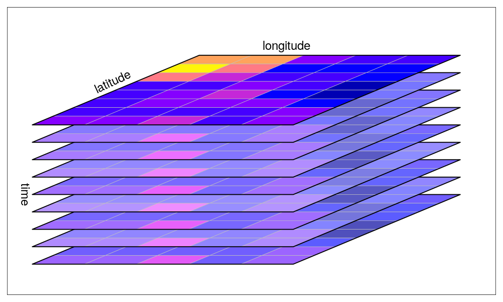
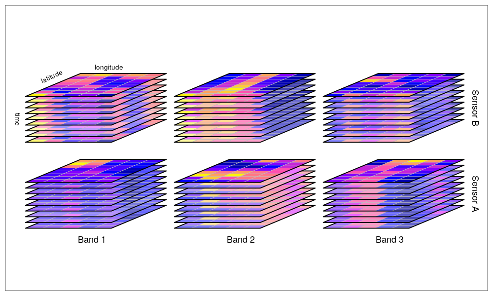

```{r lit, cache=FALSE, include=FALSE}

# create bib-file for citation of R-packages
knitr::write_bib(c("raster", "terra", "stars", "sp", "xts", "spacetime",
                   "abind", "tidyverse", "sf", "rgdal", "gdalcubes"),
  file = "refs.bib",
  prefix = "R-"
)

```

## Table of contents

**0.1 System Overview**

1. Raster
    1. Objectives & Functions
    2. Benefits
    3. Shortcomings
    4. Data Cubes
2. Stars
    1. Objectives
    2. Cubes
    3. Functionality (-> Rstudio input)
3. Terra
    1. Objectives & Functions
    2. Benefits & Drawbacks
    

```{r setup, include=FALSE}
knitr::opts_chunk$set(echo = FALSE)

library(raster)
library(stars)
library(terra)

library(tidyverse)
library(RColorBrewer)

pal = brewer.pal(8, "RdYlGn")
ras = brick("data/S2A_20161004.tif")
```

# 0.1 System Overview

## System Overview

```{r 1-overview, echo = FALSE, cache = TRUE, px = 600, fig.show = "hold", out.width = "80%", fig.align='center', fig.cap="The world of spatial processing in the programming  domain. <https://geoscripting-wur.github.io/IntroToRaster/> [accessed 27-01-2020]"}

```

# 1. Raster

## `Raster`

- Rspatial community <https://www.rspatial.org/>
- Creator: Robert J. Hijmans [@R-raster]
- First CRAN release: 2010-03-20
- **Revolution of raster processing in R**

_Geographic raster data models consist of a raster header and a matrix (with rows and columns) representing equally spaced cells (pixels)_. Geocomputation in R [@lovelace_geocomputation_2019]


```{r 1-raster_graphic, echo=FALSE, fig.align='center', fig.cap="@lovelace_geocomputation_2019"}

```

---

### Objective

- read and write raster data in most formats -> GDAL (C++)
- perform raster operations -> GEOS (C++)
- visualise data

```{r 1-brick-plot,out.width="50%" ,fig.cap="`RasterBrick` as RGB composite", echo=FALSE, fig.align='center'}
plotRGB(ras, 4, 3, 2, stretch = "hist", ext = extent(500000, 609780, 6690220, 6740000))
```

---

### Functions

* raster algebra: `+`, `-`, `*`, `/`, `>`, `abs`, `sum` (built-in functions)
* `raster()`: Read a single-layer raster object
* `stack()`: Assemble RasterLayers in a multilayer object. (Can handle different file inputs)
* `brick()`: Read a multi-layer raster object written on disk.
* `writeRaster()`: Write a RasterLayer, RasterBrick or RasterStack to disk.
* `crop()`: modify the extent of a Raster* object based on another spatial object or an extent object.
* `projectRaster()`: Reproject to a desired coordinate reference system (similar to `gdal_transform`)
* `trim()`: removes NA
* `merge()`: fuse rasters with same resolution
* `aggregate()`: resampling
* `calc()`: perform arithmetic by providing a function
* `predict()`: predicts on a model
* `plot()`: Plot a raster object, use add = TRUE to overlay several objects.
* `(. . .)` ellipse: more arguments can be passed to function, e.g. destination directory

---

### Benefits

- Raster*-functions break down tasks to lightweight chunks to be processed sequentially.
- feases most raster operations possible in desktop GIS systems (and more...)
- capacity to run in parallel
- exellent manual, support and large user community

_so... is it enough?_

## Data Cubes

<iframe width="560" height="270" src="https://www.youtube.com/embed/XVy61NsNzCU" frameborder="0" allow="accelerometer; autoplay; encrypted-media; gyroscope; picture-in-picture" allowfullscreen></iframe>

---

### `Raster` shortcomings

Supposing we want our data in a scalable structure...

- no real data cubes: either different bands _or_ time steps
- Alternatives:
  - [gdal cubes](https://github.com/appelmar/gdalcubes). e.g. in R `gdalcubes` [@R-gdalcubes]
  - `stars` objects
  - [open data cube (ODC)](https://www.opendatacube.org) <-


# 2. Stars

## `Stars`

- R-spatial community <https://www.r-spatial.org/>
- Pebesma, E.; Sumner, M & Racine, E. [@R-stars]
- First CRAN release: 2018-07-25
- Builds upon the idea implemented in `spacetime`, which rely on `sp` (_spatial_) and `xts` (_temporal_). [@R-spacetime]

### Objectives

1. heterogeneous data (`numeric`, `logical` and `Date`) as multi-dimensional arrays
2. clear and strong spatial and temporal indeces
3. large on-disc data and remote server solutions

by using `sf` methods and following the _tidy tools manifesto_. [@tidyverse2019]

---

Handles spatio-temporal data as

- raster cubes (3 dimension)
- raster hypercubes (4 & more dimension)
- vector hypercubes


```{r 3-cube, echo = FALSE, cache = TRUE, px = 200, fig.cap="Multi-dimensional raster cubes [@R-stars]", fig.show = "hold", out.width = "50%"}


```

---

```{r 3-grids, echo = FALSE, cache = TRUE, px = 300, fig.cap="Grid formats allowed as `stars`-object [@R-stars]", fig.show = "hold", out.width = "50%", fig.align='center'}
knitr::include_graphics("img/grids.png")
```


  ... also with non-regular grids.
   
---

Similarities with `sf` and `tidyverse` methods:

```{r 3-methods, echo=TRUE}
methods(class = "stars")
```

---

### Functionality

`stars_proxy`-objects are similar to virtual tile in GDAL. 

Builds upon:

* sf & tidyverse
* GDAL
* GEOS
* netCDF
* PROJ
  
They are

* not loaded into memory
* on-the-fly functions
* only accessed by metainformation and the pointer to the file directory

---

### `stars_proxy`

```{r 3-proxy, echo=TRUE}
methods(class = "stars_proxy")
```

**RStudio**


# 3. Terra
## `Terra` 

Aims to replace the `raster` package (in the future)

- rspatial community <https://www.rspatial.org/>
- creator: Robert J. Hijmans [@R-terra]
- no CRAN release yet. Stable version in July 2019 

```{r install_terra, echo=FALSE, message=FALSE, warning=FALSE}
devtools::install_github("rspatial/terra")
```

### Objective

- implements new S4 classes (SpatRaster and SpatVector)
- referring to C++ objects, much faster than `raster`
- virtual raster operations
- rectangular grid (pixels of equal size)

##
### Functions

- creating, manipulating, and writing raster data
- raster algebra
- higher-level raster operations
- integration with spatial modeling methods

### Virtual file handling (similar to `stars_proxy`-objects)
- saving metadata to objects, keeping data on disc
- processing in chunks
- no filename: temporarily stored to temporary file

**RStudio**

---

### Benefits

- new, cleaner version of `raster`
- profits from earlier experiences & development
- **R for spatio-temporal Big Data**
- good vignette and manual

### Drawbacks

- CRAN release still to come -> small community
- yet another spatial data object format?

---

```{r last, echo=FALSE, fig.align='center', fig.height=25, fig.width=30}
knitr::include_graphics("img/dataCube.gif")
```

## References